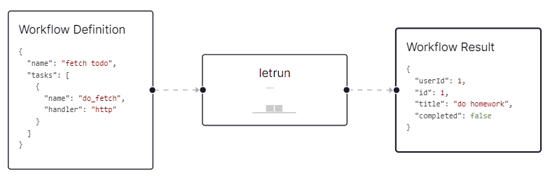

# @letrun/cli


A simple and efficient tool for running declarative workflows with ease.



Inspired by the projects [Processus](https://github.com/cloudb2/processus) and [Conductor](https://github.com/conductor-oss/conductor).

## Table of Contents

- [Concepts](#concepts)
  - [Workflow](#workflow)
    - [Defining a Workflow](#defining-a-workflow)
    - [Executing a Workflow](#executing-a-workflow)
  - [Task](#task)
    - [Defining a Task](#defining-a-task)
    - [Executing a Task](#executing-a-task)
- [Installation](#installation)
- [Usage](#usage)
- [Commands](#commands)
- [Plugin](#plugin)
- [Configuration](#configuration)
- [Development](#development)
- [License](#license)

## Concepts

### Workflow

We will discuss two distinct topics: defining a workflow and executing a workflow.

#### Defining a Workflow

The Workflow Definition is the letrun primitive that encompasses the flow of your business logic.
It contains all the information necessary to describe the behavior of a workflow.

A Workflow Definition includes a collection of tasks.
This is the blueprint that specifies the order of task execution within a workflow.
This blueprint also specifies how data/state is passed from one task to another.

Please refer to the [Workflow Structure](docs/workflow/workflow-structure.md) document for more details.

#### Executing a Workflow

If Workflow Definitions are like OOP classes, then Workflow Executions are like object instances.
Each time a Workflow Definition is invoked with a given input, a new Workflow Execution with a unique ID is created.
Definitions to Executions have a 1:N relationship.

### Task

Like a workflow, a task can be considered in two parts: defining a task and executing a task.

#### Defining a Task

Tasks are the building blocks of letrun workflows.
Task Definitions appear within the tasks array/object property of the Workflow Definition.
This tasks field is the blueprint that describes how a workflow will process an input payload by passing it through successive tasks.

A Task Definition includes a reference to the task type and the input necessary to execute the task.
The input can be static or dynamic, based on the workflow's state.

Please refer to the [Task Structure](docs/task/task-structure.md) document for more details.

#### Executing a Task

When a workflow is executed, each task within it is also executed.
The executed task has a unique ID and represents the result of the operation, also includes the status, any input, output associated with the task.

## Installation

Ensure you have [Node.js](https://nodejs.org/en/download/prebuilt-installer) (>=20) and npm (>=10) installed.

To install the CLI tool, run:

```sh
npm install -g @letrun/cli
```

Or use it directly with npx:

```sh
npx @letrun/cli <command> [options]
```

Alternatively, you can download the standalone executable file from the [releases page](https://github.com/sontx/letrun/releases).

## Usage

Run a workflow defined in a JSON or YAML file with the CLI tool:

```sh
letrun run <workflow-file>
```

If you want to run a workflow programmatically, you can use the engine library

- Make sure you have installed the `@letrun/engine` package:

```sh
npm install @letrun/engine
```

- Then you can run a workflow programmatically:

```ts
import { DefaultRunner } from '@letrun/engine';

const runner = DefaultRunner.create();
try {
  const result = await runner.run(
    {
      name: 'simple-workflow',
      tasks: [
        {
          name: 'task1',
          handler: 'lambda',
          parameters: {
            expression: '"Hello ${input.name}"',
          },
        },
      ],
    },
    {
      name: 'world',
    },
  );
  console.log('Workflow result: ', result);
} finally {
  await runner.unload();
}
```

## Commands

We have several commands to interact with the CLI tool:

```shell
letrun [command] [options]
```

- [run](docs/command/run): Execute a workflow defined in a JSON or YAML file.
- workflow: Manage saved workflows.
  - [show](docs/command/workflow-list): Show a list of saved workflows.
  - [view](docs/command/workflow-view): View the details of a saved workflow.
  - [delete](docs/command/workflow-delete): Delete a saved workflow.
  - [clear](docs/command/workflow-clear): Clear all saved workflows.
  - [install](docs/command/workflow-install): Install a workflow's dependencies.
- plugin: Manage plugins.
  - [list](docs/command/plugin-list): List all available plugins.
  - [view](docs/command/plugin-view): View the details of a plugin.
- task: View and manage custom tasks.
  - [list](docs/command/task-list): List all available system/custom tasks.
  - [view](docs/command/task-view): View the details of a system/custom task.
  - [run](docs/command/task-run): Run a task directly without a workflow.
  - [install](docs/command/task-install): Install a custom task package.
  - [versions](docs/command/task-versions): List all installed custom task packages.

## Plugin

Plugins are used to extend the functionality of the CLI tool.
All the main features are implemented as plugins (system plugins), so any of them can be replaced or extended by custom plugins.

Plugins can provide additional features, or even modify the execution behavior.

See more details in the [Plugin](docs/plugin/plugin.md) document.

## Configuration

The CLI tool can be configured using a configuration file or environment variables.
The configuration provider will look up in this order:

1. `letrun.json` in the runner directory.
2. `letrun.yaml` in the runner directory.
3. `letrun.yml` in the runner directory.
4. Lookup from environment variables.

> The lookup key can be JSON path format, e.g., `plugin.dir` will be either the `plugin.dir` field or `dir` field in `plugin` object in JSON format.
> The YAML format will be converted to JSON format before lookup.

When lookup a key, we will use the following priority: exact key -> uppercase key -> camelCase key -> kebab-case key.

The default configuration is:

```json
{
  "plugin": {
    "dir": "plugins"
  },
  "task": {
    "dir": "tasks"
  },
  "persistence": {
    "dir": "data"
  },
  "logger": {
    "level": "debug",
    "console": {
      "showMeta": true,
      "metaStrip": "timestamp,service",
      "showTimestamp": true,
      "timestampFormat": "HH:mm:ss.SSS",
      "inspectOptions": {
        "depth": -1,
        "colors": true,
        "maxArrayLength": -1,
        "breakLength": 120,
        "compact": -1
      }
    }
  },
  "interpolator": {
    "maxRecursionLevel": 10
  }
}
```

## Development

### Prerequisites

- [Node.js](https://nodejs.org/en/download/prebuilt-installer) (>=20)
- npm (>=10)

### Setup

There are four projects:

- `core`: The core library that contains the shared types, interfaces, and utilities.
- `plugin`: The plugin library that contains the system plugins.
- `task`: The task library that contains some custom tasks.
- `deps`: Provides a way to manage dependencies for the CLI tool.
- `engine`: The engine library that contains the workflow engine, you can run a workflow programmatically.
- `cli`: The CLI tool 😉

1. Clone the repository:

```sh
git clone https://github.com/sontx/letrun.git
```

2. Install dependencies:

```sh
npm install
```

3. Build the projects:

```sh
npm run build
```

4. Run the CLI tool:

```sh
cd dist

node letrun.js <workflow-file>
```

### License

This project is licensed under the MIT License - see the [LICENSE](LICENSE) file for details.
