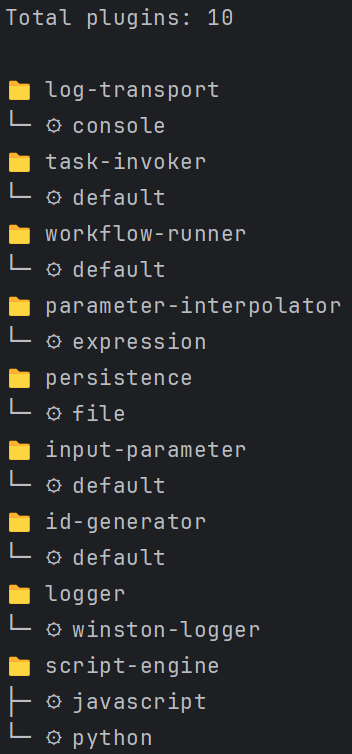

# `list` Plugin Command

The `list` command is used to list all installed plugins. This command does not require any arguments or options.



## Usage

```sh
letrun plugin list
```

### Examples

#### List all installed plugins

```sh
letrun plugin list
```
