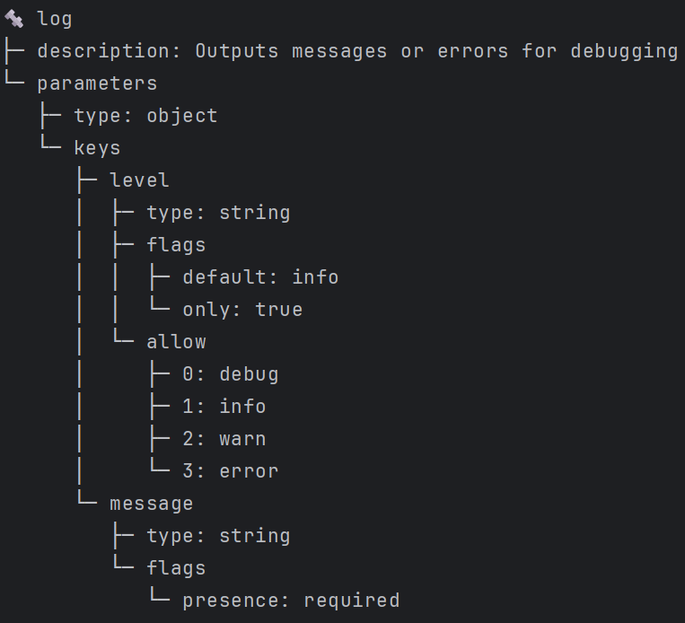

# `view` Tasks Command

The `view` command is used to display the details of a task.
This command allows you to specify the name of the task and optionally the group to which the task belongs.



## Usage

```sh
letrun task view <name> [options]
```

### Arguments

- `<name>`: The name of the task to view.

### Options

- `-g, --group <group>`: The group of the task. Use `.` if you want to search tasks that don't have a group.

### Examples

#### View a task by name

```sh
letrun task view task-name
```

#### View a task by name and group

```sh
letrun task view task-name -g task-group
```
