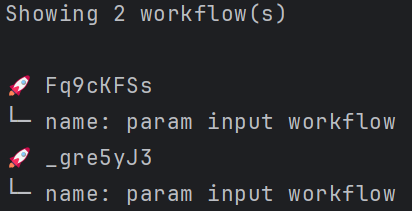
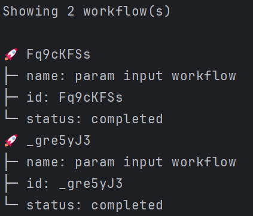

# `list` Workflow Command

The `list` command is used to list all saved workflows.
This command allows you to specify the maximum number of workflows to list,
the offset to start listing workflows, and additional fields to include in the output.

## Usage

```sh
letrun workflow list [options]
```

### Options

- `-m, --max <max>`: The maximum number of workflows to list (default: 30).
- `-o, --offset <offset>`: The offset to start listing workflows (default: 0).
- `-w, --with <with>`: Additional fields to include in the output, e.g., `id,status`.

### Examples

#### List all saved workflows

```sh
letrun workflow list
```



#### List a maximum of 10 workflows

```sh
letrun workflow list -m 10
```

#### List workflows starting from the 5th one

```sh
letrun workflow list -o 5
```

#### List workflows with additional fields

```sh
letrun workflow list -w id,status
```


