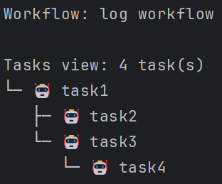
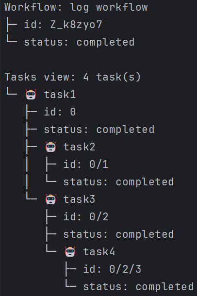

# `view` Workflow Command

The `view` command is used to display the details of a workflow.
This command allows you to specify the path to the workflow file or the workflow ID and include additional fields in the output.



## Usage

```sh
letrun workflow view <pathOrId> [options]
```

### Arguments

- `<pathOrId>`: The path to the workflow file or the ID of the saved workflow.

### Options

- `-w, --with <with>`: Show additional fields, e.g., `id,status`.

### Examples

#### View a workflow by file path

```sh
letrun workflow view path/to/workflow.json
```

#### View a workflow by ID

```sh
letrun workflow view workflow-id
```

#### View a workflow with additional fields

```sh
letrun workflow view workflow-id -w id,status
```


