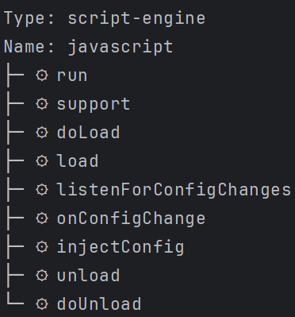

# `view` Plugin Command

The `view` command is used to display the details of a plugin.
This command allows you to specify the type of the plugin and optionally the name of the plugin.



## Usage

```sh
letrun plugin view [options]
```

### Options

- `-t, --type <type>`: The type of the plugin.
- `-n, --name <name>`: The name of the plugin (optional).

### Examples

#### View a plugin by type

```sh
letrun plugin view -t plugin-type
```

#### View a plugin by type and name

```sh
letrun plugin view -t plugin-type -n plugin-name
```
