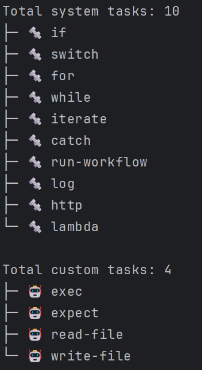

# `list` Tasks Command

The `list` command is used to list all tasks.
This command allows you to specify whether to list custom tasks, system tasks, or both, and include additional fields in the output.



## Usage

```sh
letrun task list [options]
```

### Options

- `-c, --custom`: List custom tasks only.
- `-s, --system`: List system tasks only.
- `-w, --with <with>`: Include additional fields in the output, e.g., `id,status`.

### Examples

#### List all tasks

```sh
letrun task list
```

#### List custom tasks only

```sh
letrun task list -c
```

#### List system tasks only

```sh
letrun task list -s
```

#### List tasks with additional fields

```sh
letrun task list -w id,status
```
